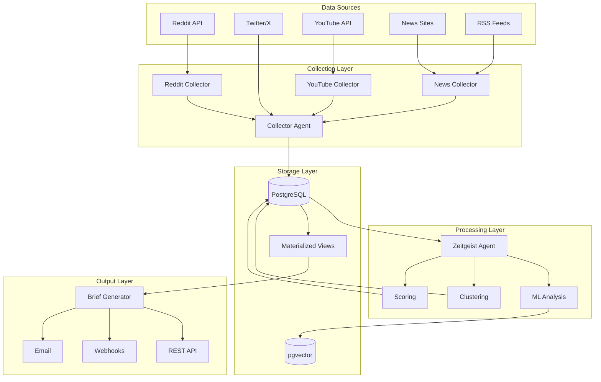

# Architecture Overview

The Envy Zeitgeist Engine is a distributed system for collecting, analyzing, and reporting on pop culture trends. This document describes the system architecture, design decisions, and component interactions.

## Table of Contents
- [System Overview](#system-overview)
- [Component Architecture](#component-architecture)
- [Data Flow](#data-flow)
- [Technology Stack](#technology-stack)
- [Design Patterns](#design-patterns)
- [Scalability](#scalability)
- [Security](#security)

## System Overview



## Component Architecture

### 1. Collection Layer

#### Collector Agent (`agents/collector_agent.py`)
- **Purpose**: Orchestrates data collection from multiple sources
- **Responsibilities**:
  - Query expansion using LLMs
  - Source coordination
  - Deduplication
  - Validation
  - Batch processing

#### Individual Collectors
- **Reddit Collector**: Subreddit monitoring, hot/new posts
- **YouTube Collector**: Trending videos, channel monitoring
- **News Collector**: RSS feeds, web scraping
- **Entertainment Collector**: Celebrity news, gossip sites

### 2. Processing Layer

#### Zeitgeist Agent (`agents/zeitgeist_agent.py`)
- **Purpose**: Analyzes collected data to identify trends
- **Key Functions**:
  - Topic clustering using HDBSCAN
  - Trend scoring algorithm
  - Time-series forecasting
  - Entity extraction

#### ML Components
- **Embeddings**: OpenAI text-embedding-ada-002
- **Clustering**: HDBSCAN with TF-IDF
- **Forecasting**: ARIMA models
- **NER**: spaCy for entity recognition

### 3. Storage Layer

#### PostgreSQL with pgvector
- **Schema Design**:
  ```sql
  raw_mentions (
    id: TEXT PRIMARY KEY,        -- SHA-256 hash
    source: TEXT,                -- Platform
    embedding: VECTOR(1536),     -- OpenAI embedding
    platform_score: NUMERIC,     -- Normalized engagement
    entities: TEXT[],            -- Extracted entities
    extras: JSONB                -- Platform-specific data
  )
  
  trending_topics (
    id: SERIAL PRIMARY KEY,
    headline: TEXT,
    score: NUMERIC,
    forecast: TEXT,
    cluster_ids: INTEGER[]
  )
  ```

#### Optimization Strategies
- Materialized views for common queries
- Partial indexes for high-value content
- Connection pooling (20-40 connections)
- Automatic data cleanup (30-day retention)

### 4. Output Layer

#### Brief Generation
- **Templates**: Daily, Weekly, Email, Custom
- **Format**: Markdown with mobile optimization
- **Scheduling**: Cron-based automation
- **Delivery**: Email, webhooks, API

## Data Flow

### 1. Collection Pipeline
```
External APIs → Collectors → Validation → Deduplication → Storage
```

### 2. Analysis Pipeline
```
Raw Mentions → Embeddings → Clustering → Scoring → Forecasting → Topics
```

### 3. Output Pipeline
```
Topics → Template Selection → Content Generation → Delivery
```

## Technology Stack

### Core Technologies
- **Language**: Python 3.11
- **Async Framework**: asyncio
- **Web Framework**: aiohttp
- **Database**: PostgreSQL 14+ with pgvector
- **Container**: Docker with multi-stage builds
- **Orchestration**: Apache Airflow

### ML/AI Stack
- **Embeddings**: OpenAI API
- **Clustering**: scikit-learn, HDBSCAN
- **Time Series**: statsmodels
- **NLP**: spaCy

### Infrastructure
- **Monitoring**: Prometheus + Grafana
- **Logging**: Structured JSON with loguru
- **Tracing**: OpenTelemetry (optional)
- **Queue**: Redis (optional)

## Design Patterns

### 1. Repository Pattern
```python
class EnhancedSupabaseClient:
    async def get_recent_mentions(self, hours: int) -> List[Dict]:
        # Abstraction over database queries
```

### 2. Strategy Pattern
```python
class MarkdownTemplate(ABC):
    @abstractmethod
    def generate(self, topics: List[TrendingTopic]) -> str:
        pass

class DailyBriefTemplate(MarkdownTemplate):
    def generate(self, topics: List[TrendingTopic]) -> str:
        # Daily-specific implementation
```

### 3. Circuit Breaker Pattern
```python
@circuit_breaker(failure_threshold=5, timeout_duration=60)
async def external_api_call():
    # Prevents cascading failures
```

### 4. Decorator Pattern
```python
@retry_async(max_attempts=3)
@collect_metrics
@handle_errors
async def collect_data():
    # Layered functionality
```

## Scalability

### Horizontal Scaling
- Stateless collectors can be replicated
- Database read replicas for analysis
- Distributed task queue (Celery/RQ)

### Vertical Scaling
- Async I/O for concurrent operations
- Batch processing for bulk operations
- Connection pooling for database

### Performance Optimizations
- Materialized views for complex queries
- Caching with Redis
- Lazy loading of embeddings
- Partial processing for large datasets

## Security

### API Security
- Environment-based secrets management
- Rate limiting per API key
- Request signing where supported

### Database Security
- Row-level security in Supabase
- Encrypted connections
- Parameterized queries only

### Container Security
- Non-root user execution
- Read-only root filesystem
- Security scanning with Trivy
- Minimal base images

### Data Privacy
- PII detection and redaction
- GDPR compliance considerations
- Data retention policies
- Audit logging

## Monitoring and Observability

### Metrics Collection
```python
@collect_metrics(operation_name="data_collection")
async def collect():
    # Automatic metric collection
```

### Health Checks
- Database connectivity
- API availability
- Memory/CPU usage
- Queue depth

### Alerting Hierarchy
1. **Critical**: Pipeline failures, data loss
2. **High**: API errors, performance degradation
3. **Medium**: Rate limits, quality issues
4. **Low**: Optimization opportunities

## Future Considerations

### Planned Improvements
1. **Real-time Processing**: WebSocket integration
2. **Multi-language Support**: i18n for global trends
3. **Advanced ML**: Transformer models for better analysis
4. **GraphQL API**: Flexible data queries
5. **Event Sourcing**: Complete audit trail

### Scaling Challenges
- Embedding storage optimization
- Real-time clustering at scale
- Cross-region replication
- Cost optimization for API calls